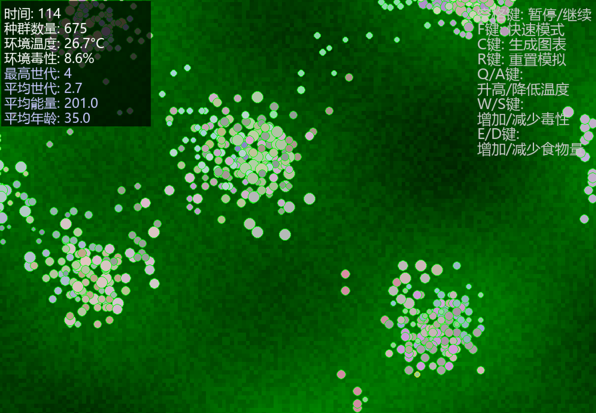

这是一个单细胞生物进化模拟程序:

1. 生物系统

DNA编码 ：每个生物有8个特征基因：

体型(SIZE)：影响进食量和可见大小

速度(SPEED)：影响移动能力

感知(SENSE)：影响食物探测范围

繁殖(REPRODUCTION)：影响繁殖效率

防御(DEFENSE)：抵抗环境危害

寿命(LIFESPAN)：最大生存时间

新陈代谢(METABOLISM)：能量消耗速度

毒素抗性(TOXIN_RESISTANCE)：抵抗环境毒性

生物行为 ：

移动：根据感知寻找食物

进食：消耗环境中的食物

繁殖：消耗能量产生后代

死亡：能量耗尽、寿命到期或环境危害

2. 环境系统

食物分布 ：基于正弦函数的自然分布，随时间再生

温度 ：缓慢波动变化

毒性 ：环境毒素水平随时间变化，影响生物健康

3. 进化机制

突变 ：繁殖时DNA有小概率发生随机变异

自然选择 ：

适应性强的生物能获取更多食物

繁殖能力强的生物能产生更多后代

能抵抗环境毒素的生物存活更久

遗传 ：后代继承父母的DNA（带突变）

4. 可视化系统

主视图 ：

绿色背景表示食物分布（颜色越亮食物越多）

圆形生物体（颜色表示特征组合）

实时显示环境参数和种群信息

进化图表 （按C键生成）：

种群数量变化曲线

特征进化趋势图

生物特征雷达图

5. 控制功能

空格键: 暂停/继续  
F键: 快速模式
C键: 生成图表  
R键: 重置模拟
Q/A键: 升高/降低温度
W/S键:增加/减少毒性
E/D键: 增加/减少食物量
